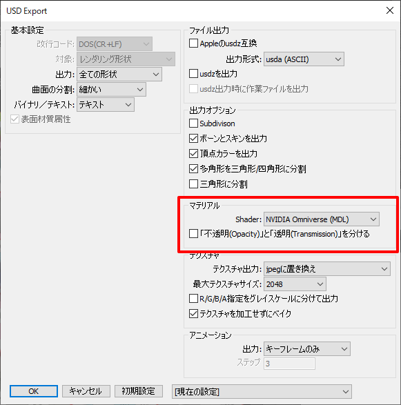
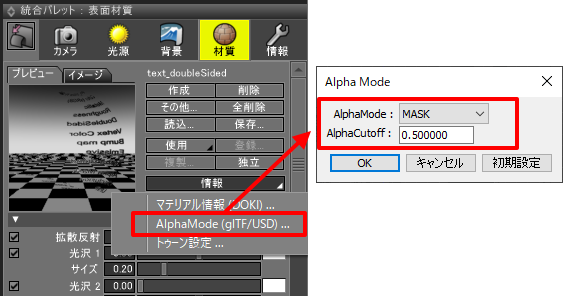
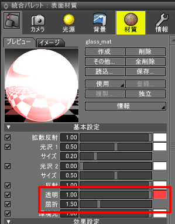
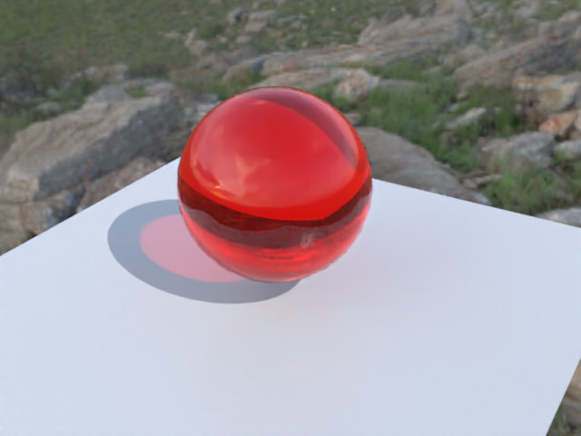
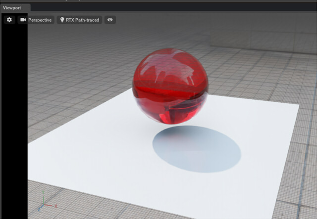
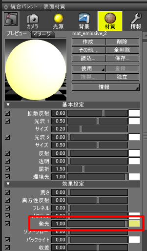
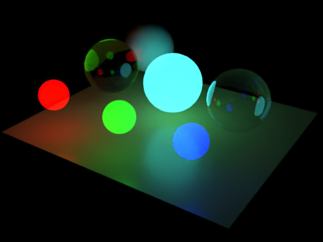
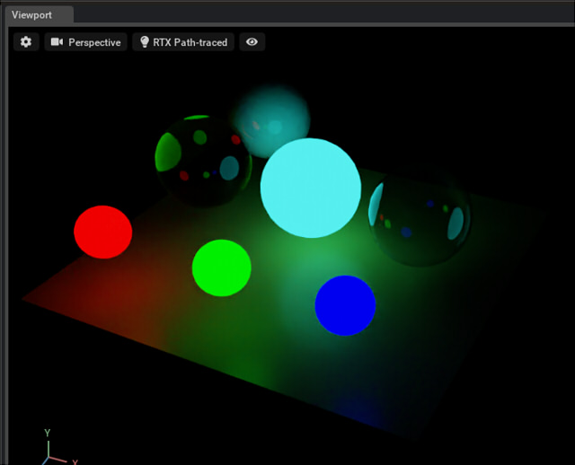

# NVIDIA Omniverse対応について

これは、Omniverse Create 2021.1.1使用時の情報になります。     

## NVIDIA Omniverseとは ?

NVIDIA OmniverseはNVIDIA社が提供しています。      
Omniverseはリアルタイムシミュレーションや、複数人で3D情報を共有して共同で作業を行う場を提供したりできる、     
オープンなプラットフォームです。      
2021年5月段階ではオープンベータです。      

https://www.nvidia.com/ja-jp/omniverse/

開発ツール、映像表現やシミュレーションなどを行う仮想環境（リアルタイムレイトレーシング使用）、Omniverseにつなぐコネクタ、
サーバ環境(Nucleus)、などさまざまな機能が提供されています。    
用途としては、建築のためのビュワー、複数人で作業を共有、映像制作、AI(3D Deep Learning)のための学習環境、シミュレーション環境、アセットの管理、などさまざまです。     

リアルタイムレイトレーシングを使用した3DCG表現を行う環境が提供されています。     
オフラインレンダラのようなフォトリアルな品質をリアルタイムで表現することができます。      
なお、NVIDIA社のRTX対応のグラフィック環境が必要です。      

動作に必要な環境は以下に記載されています。      

https://docs.omniverse.nvidia.com/plat_omniverse/plat_omniverse/technical.html

3Dとしてだけではなく、「Nucleus」という仕組みを使用することで3Dモデルを共有する環境を構築できます。      

これらのすべての基盤になるファイルフォーマットが「USD」になります。      
シーンファイルは、USD形式で保持されます。      
また、コネクタを使用しての相互の情報交換もUSDを使用して行います。      
3Dモデルの受け渡しもUSDファイルを使用します。     

## USD Exporter for Shade3DからUSDファイルを渡す

Omniverseは、USDの標準のマテリアルのShaderである「UsdPreviewSurface」を受け取ることができますが、これは表現として弱い部分があります。     

そこで、OmniverseではMDL(Material Definition Language)を使用して表現を拡張しています。      
MDLはNVIDIA社が提供しているShader言語です。     
Omniverseでは「OmniPBR」と「OmniGlass」といった、あらかじめ用意されたMDLのShaderを指定できます。       
「OmniPBR」はPBRマテリアルを表現、「OmniGlass」は透明度のあるガラス表現を行います。      
MDLを使用すると、より表現の幅が広がります。      
USD Exporter for Shade3Dでは、この「OmniPBR」と「OmniGlass」の出力に対応しています。      

エクスポートダイアログボックスの「マテリアル」の「Shader」で「NVIDIA Omniverse(MDL)」を選択すると、     
USDのマテリアルのShaderとしてMDL用の出力を行います。     
    

なお、MDL用の出力を行った場合、Pixarの提供するusdviewやAppleのAR Quick Lookではマテリアルが正しく表現できなくなるため注意が必要です。      
「OmniPBR」や「OmniGlass」のMDL出力は、Omniverse環境でのみ使用できる指定になります。     

## 不透明(Opacity)と透明度(Transmission)を分ける

※ この表現は「NVIDIA Omniverse(MDL)」時にのみ有効です。      

エクスポート時に「不透明(Opacity)と透明度(Transmission)を分ける」チェックボックスをOnにすると、Shade3Dの「不透明マスク」はCutout(Cutoff)として使用されます。    
なお、「不透明マスク」でCutout表現を行う際は表面材質ウィンドウの「情報」で「AlphaMode (glTF/USD)」を選択し、      
「AlphaMode」で「MASK」を選択するようにします。     
    
テクスチャのピクセル値で「AlphaCutoff」値をしきい値にしてピクセル単位のトリミングを行います。     
これにより、木の葉のような表現を行うことができます。      

「透明」が0.0よりも大きい場合は、Omniverseに渡したときに「OmniGlass」のShaderが割り当てられます。     
    
「透明」スライダの値はOmniverse側では反映されず、常に「グラス」になります。      
また、「OmniGlass」のShaderでは「屈折」の値を反映することができます。      
ガラスを濁らせる場合は「荒さ」の値を上げるようにしてください。    

以下はShade3D上でのレンダリング(DOKI for Shade3D(OSPRay)を使用)です。    
    
これをUSDでエクスポートしてOmniverse Createに渡すと、以下のようになりました。     
RTX Path-tracedのリアルタイムパストレーシング表現です。     
    
なお、現在のUSD Exporter for Shade3Dで渡されるのは3Dモデルとテクスチャのみです。     
背景のHDRIや光源はOmniverse側で割り当てました。     

このような透明＋屈折は、UsdPreviewSurfaceでは表現できないものになります。     

## 発光の指定

※ この表現は「NVIDIA Omniverse(MDL)」時にのみ有効です。      

表面材質の「発光」が0.0よりも大きい場合、スライダの値が発光の強さとして使用されます。      
また発光の色は発光色として使用されます。      
    
Omniverseに渡す際は「発光の強さ * 5000」が「OmniPBR」の「Emissive Intensity」に入ります。      

以下はShade3D上でのレンダリング(DOKI for Shade3D(OSPRay)を使用)です。    
    
これをUSDでエクスポートしてOmniverse Createに渡すと、以下のようになりました。     
    

## Omniverseでの制限事項

現在は以下のような制限があります。     
Omniverse Create 2021.1.1段階の情報です。     

* DoubleSided指定はできません。常に両面描画となります。      
* UVレイヤは1層だけ使用できます。
* 頂点カラーを表現することはできません。
* 4角形以上の多角形を使用している場合は、うまく面が表現できないときがあります。    
この場合は、USD Exporter for Shade3Dのエクスポートオプションで「多角形を三角形/四角形に分割」「三角形に分割」チェックボックスをOnにしてください。    
* Unlit表現はできません（これはUSD自身にその仕様がないため）。

