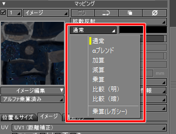
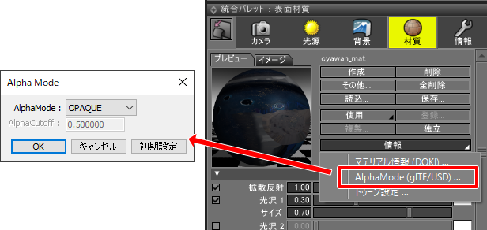
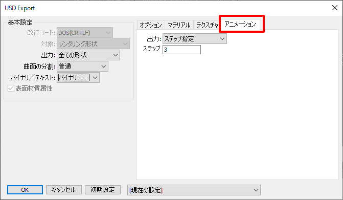

# USD Exporter for Shade3D

PixarのUSD(Universal Scene Description)形式 ( https://graphics.pixar.com/usd/docs/index.html )のファイルをエクスポートするプラグインです。    
USDファイルとテクスチャをzipにまとめて1つにしたusdz形式を使用することで、AppleのiOS/iPadOSでARとして3Dモデルを使うことができるようになります。    

USD Exporterプラグインと、USDの動的ライブラリは対応するバージョンを使用しないと正しく動作しません。     
USD Exporter ver.0.1.0.0以降は「USD 21.02」を使用しています。     

## USDについて

PixarのUSDについては、以下のページをご参照ください。    
https://graphics.pixar.com/usd/docs/index.html    

USDはオープンソースのフォーマットになります。    
https://github.com/PixarAnimationStudios/USD    

## USD Exporterの機能

以下の機能があります。    

* Shade3Dから、PixarのUSD形式/1つにまとめたUSDZ形式のファイルをエクスポート。

## 動作環境

* Windows 7/8/10以降のOS    
* macOS 10.11以降   
* Shade3D ver.14以降で、Standard/Professional版（Basic版では動作しません）  
  Shade3Dの64bit版のみで使用できます。32bit版のShade3Dには対応していません。   

## プラグインの配置、Shade3Dの起動方法 (Windows)

Windows版でのUSD Exporterプラグインでのインストールを行います。    

### プラグインと関連ファイルをダウンロード

関連ファイルは以下からダウンロードできます。    
https://github.com/ft-lab/Shade3D_USDExporter/releases    

USDファイルをエクスポートするために参照する動的ライブラリ(DLL)と関連ファイル、Shade3Dプラグインの両方が必要になります。    

https://github.com/ft-lab/Shade3D_USDExporter/releases/download/usd_dlls_21_02/usd_dlls_2102.zip    

より、「usd_dlls_2102.zip」をダウンロードします。    
usd_dlls_2102.zipを解凍し、任意の場所に配置します。    
解凍すると、「usd_dlls」フォルダに「bin」と「lib」のフォルダが入っています。     
また、環境変数のPATHを通してShade3Dを起動するためのバッチファイル「run_shade3d_v17.bat」を同梱しています。    
これについては後述します。    

次に、Shade3Dプラグインをダウンロードします。    

https://github.com/ft-lab/Shade3D_USDExporter/releases    
より、最新の「USDExporter_ver_xxxx_win.zip」のzipファイルをダウンロードして解凍します。    

### プラグインを配置し、Shade3Dを起動

Windowsの場合は、USDExporter64.dll をShade3Dのpluginsディレクトリに格納します。     

Shade3D実行時に「usd_dlls/bin」「usd_dlls/lib」フォルダへのPATH指定が必要です。    

以下のように、バッチファイル（*.bat）をテキストエディタで作ってShade3Dを起動します。    

    set USD_DLLS_PATH=E:\Data\Shade3D\USDExporter\usd_dlls    
    set PATH=%USD_DLLS_PATH%\bin;%USD_DLLS_PATH%\lib;%PATH%    

    set Shade3D_APP=C:\Program Files\Shade3D\Shade3D ver.17

    "%Shade3D_APP%\bin\shade.exe"

このファイルは「 https://github.com/ft-lab/Shade3D_USDExporter/tree/master/run_scripts/win 」にいくつかShade3Dのバージョンごとのサンプルをおいていますので、ご参照くださいませ。     

USD_DLLS_PATHは「usd_dlls」フォルダを展開したパスを指定します。    
set PATHで環境設定のパスを指定しています。    
この場合は、Shade3D ver.17を起動しています。    

「USD_DLLS_PATH」の指定を環境に合わせて書き換え、「Shade3D_APP」の「C:\Program Files\Shade3D\Shade3D ver.17」を    
Shade3Dのバージョンに合わせて書き換えるようにしてください。    

Shade3Dの実行は、Shade3Dのアプリケーションアイコンをダブルクリックして起動するのではなく、    
エクスプローラでこのバッチファイルをダブルクリックして実行するようにします。    
Shade3Dが起動したら、メインメニューの「ファイル」-「エクスポート」-「USD」が表示されるのを確認します。     

## プラグインの配置、Shade3Dの起動方法 (Mac)

Mac版でのUSD Exporterプラグインでのインストールを行います。    
Mac版は、プラグイン自身にUSD 21.02の動的ライブラリ(dylib)と関連ファイルが同梱されています。     

Mac版のShade3Dプラグインをダウンロードします。    

https://github.com/ft-lab/Shade3D_USDExporter/releases    
より、最新の「USDExporter_ver_xxxx_mac.zip」のzipファイルをダウンロードして解凍します。    

### プラグインを配置し、Shade3Dを起動

USDExporter.shdplugin をShade3Dのpluginsディレクトリに格納します。     

Shade3D実行時にUSDエクスポートで使用する動的ライブラリ(dylib)のPATH指定が必要です。    

以下のように、バッチファイル（*.command）をテキストエディタで作ってShade3Dを起動します。    

    #!/bin/sh
    
    # Shade3Dのアプリケーションのフルパス.
    Shade3D_APP="/Volumes/HD-PEU2/Application/Shade3D ver.17.app"
    
    # Shade3Dのドキュメントディレクトリのフルパス.
    Shade3D_PLUGINS_PATH="/Users/UserName/Documents/Shade3D/Shade3D ver.17/plugins"
    
    export DYLD_LIBRARY_PATH="${Shade3D_PLUGINS_PATH}/USDExporter.shdplugin/Contents/Frameworks"
    
    "${Shade3D_APP}/Contents/MacOS/xshade"

このファイルは「 https://github.com/ft-lab/Shade3D_USDExporter/tree/master/run_scripts/mac 」にいくつかShade3Dのバージョンごとのサンプルをおいていますので、ご参照くださいませ。     

「Shade3D_APP」はShade3Dのパッケージをフルパスで指定します。    
「Shade3D_PLUGINS_PATH」はログインユーザ別のドキュメントフォルダ内のShade3Dのプラグインを格納するパスです。     
上記はユーザ名「UserName」、Shade3Dのバージョンをver.17としているため、環境に合わせて書き換えるようにしてください。    

「DYLD_LIBRARY_PATH」はUSDの動的ライブラリの検索パスを追加する指定です。     
複数のパスを指定する場合は「:」で区切って指定するようにします。    
「"${Shade3D_APP}/Contents/MacOS/xshade"」により、Shade3Dを実行します。     

Shade3Dの実行は、Shade3Dのアプリケーションアイコンをダブルクリックして起動するのではなく、    
ファインダーでこのcommandファイルをダブルクリックして実行するようにします。    
Shade3Dが起動したら、メインメニューの「ファイル」-「エクスポート」-「USD」が表示されるのを確認します。     

※ Mac版でUSDエクスポート時にクラッシュする場合は、上記の動的ライブラリの検索パスの指定が失敗している可能性があります。     

## 使い方

出力したいシーンを作成します。    
この操作は、通常のShade3Dでのモデリング工程になります。   
モデリング時の注意点などは後述します。    
メインメニューの「ファイル」-「エクスポート」-「USD」を選択します。    
この項目が存在しない場合は、プラグインやUSDを作成するためのdllのパスが適切に指定されているか確認してください。    
    
「USD Export」ダイアログボックスでオプションを指定できます。    
エクスポートオプションについては後述します。    
OKボタンを押すと、ファイルダイアログボックスが表示されるため、usdcまたはusdaとして指定のフォルダに保存します。   

## エクスポートされるファイルについて

USDでは、テキスト形式の「usda」、バイナリ形式の「usdc」のどちらかの出力形態があります。    
USD Exporterプラグインでは、エクスポートオプションでどちらを出力するか選択できます。     
また、どちらの場合でもテクスチャイメージはjpgまたはpng形式で外部参照の形で別途出力されます。    

エクスポートオプションで「usdzを出力」がOnの場合は、「usda(もしくはusdc)」ファイルとテクスチャイメージがzipにまとめられて「usdz」の拡張子で出力されます。    

エクスポートされるファイルの説明です。    

|ファイル拡張子|説明|    
|---|---|    
|usda|USDのシーンファイル (ASCII形式)|    
|usdc|USDのシーンファイル (バイナリ形式)|    
|jpg/png|参照しているテクスチャイメージ|    
|usdz|usda(usdc)とテクスチャイメージを1つのファイルにまとめてzipにしたもの。zip圧縮はされません。|    

### iOS/iPadOSのスマートフォン/タブレットでARする場合

このusdzファイルをiOS/iPadOSのスマートフォンまたはタブレットに、iCloudやdropbox、メールなどを通して渡し、    
「AR Quick Look」（標準ビュワー）で開くことで、ARとして3Dモデルを見ることができます。    
なお、iOS12以降で動作し、iOS13/iPadOS13以降を推奨しています。    

iOS/iPadOSでARする場合は、usdzのファイルのみが必要になります。    
その他のファイル(usda/usdc/テクスチャファイル)は不要です。     
usdzとして出力する場合は、ファイルサイズを小さくするためにusdcとして出力し、テクスチャは極力jpegファイルで出力することを推奨します。     

以下は、Shade3Dでの3Dモデルの表示です。     
    
以下は、iOS13のAR Quick LookでのAR表示です。    
    

## 対応している機能

* USDのバイナリ(拡張子 usdc)またはテキスト(拡張子 usda)とテクスチャの出力
* zipにまとめたusdz形式の出力
* iOS12/iOS13以降のAR表示への対応
* ポリゴンメッシュとして形状出力
* ポリゴンメッシュのフェイスグループを考慮
* マテリアルはPBR (diffuse/roughness/metallic/normal/emissive/occlusion/opacity) として出力
* 表面材質の「陰影付けしない」をOnにすることで、Unlit風表現を行う
* ポリゴンメッシュのUV層は最大2つまで対応 (ただし、iOS12/13/14では1UVしか認識しない)
* ボーン＋スキンを使用したアニメーション出力対応
* ボールジョイント内に形状を入れた場合、位置と回転をアニメーションのキーフレームとして出力
* [ 検証用 ] ポリゴンメッシュのSubdivisionの状態を保持したまま出力。ただし、稜線のシャープネス（crease） 対応はまだ未対応 (ver.0.0.1.1-)
* マテリアルで、複数テクスチャのベイク対応 (ver.0.0.2.0-)    
* マテリアルで、マッピングレイヤの左右反転/上下反転/90度回転/色反転のベイク対応 (ver.0.0.2.0-)    
* マテリアルで、「不透明マスク」「マット」対応 (ベイク出力時) (ver.0.0.2.0-)    
* 表面材質の指定をPBRマテリアルと仮定して、加工せずに出力 (ver.0.1.0.0 - )
* NVIDIAのOmniverse ( https://www.nvidia.com/ja-jp/omniverse/ )のため、マテリアルをMDL（OmniPBR/OmniGlass）として出力 (ver.0.1.1.0 - )

## シーン階層と形状

シーンの階層構造は極力そのままUSDの構造に出力するようにしています。    
複数形状を配置することもできます。    
ただし、形状名/マテリアル（マスターサーフェス）名として全角文字を使えないため、
その場合はエクスポート時に自動的にASCII文字列に置き換えられます。    

自由曲面や回転体/掃引体などは、すべてポリゴンメッシュに変換されてエクスポートされるため、そのままでも問題ありません。    
レンダリングブーリアンには対応していないため（穴あきなど）、その場合はブール演算などを使用してポリゴンメッシュにするようにしてください。    

iOS/iPadOSでリアルタイムでAR表示する目的の場合は、極力面数やマテリアル/テクスチャ数を抑えるように最適化する必要があります。    

パートを使用する場合、変換行列に「せん断」要素が入っていると子形状の位置が正しくなりません。    
「せん断」は(0, 0, 0)になるようにします。    

## 表面材質（マテリアル）の表現 (「テクスチャを加工せずにベイク」On)

この機能はver.0.1.0.0で実装されました。    
USDでは「PBRマテリアル」として、diffuse(albedo)/normal/roughness/metallic/emissive/opacity/occlusionを値として、またはテクスチャとして割り当てることができます。     
エクスポート時に「テクスチャを加工せずにベイク」チェックボックスをOnにすることで、    
表面材質の各パラメータを単純な入れ物として扱います。    
この場合は、Shade3Dのレンダリング結果とあえて一致させていません。      

この指定は、「DOKI for Shade3D」( http://www.ft-lab.ne.jp/shade3d/DOKI/ )でのPBRマテリアルの指定を、そのままUSDとしてエクスポートできるようにするためのものになります。     

### 基本設定/効果設定で参照するもの

※ これは「テクスチャを加工せずにベイク」がOn時の説明になります。    

    

|Shade3Dのパラメータ|USDでのパラメータ|使用要素|テクスチャ|意味|
|---|---|---|---|---|
|拡散反射 (値と色)|diffuseColor|RGB|持てる|色(RGB)情報|
|反射 (値)|metallic|グレイスケール|持てる|反射（映り込み）の強さ|
|透明 (値)|1.0 - opacity|グレイスケール|持てる|不透明度(opacity)の逆|
|屈折 (値)|ior|値のみ|-|屈折率|
|荒さ (値)|roughness|グレイスケール|持てる|ざらつきの強さ|
|発光 (値と色)|emissive|RGB|持てる|発光の強さ|

これらの指定は、PBRマテリアルとしての表現となる点に注意してください。    
たとえば、鏡のような鏡面反射を行う場合、拡散反射をRGB(1.0, 1.0, 1.0)、反射を1.0、荒さを0.0と指定します。     
Shade3Dのレンダリングに合わせて拡散反射をRGB(0.0, 0.0, 0.0)とすると、USDで出力した際は黒光りの表現になります。    

また、PBRマテリアルでは金属のような反射など基本は屈折率は1.5を指定します。    
USD Exporter使用時は、透過しない場合でも屈折を1.5としておいたほうがよい結果になります。     

### マッピングで参照するもの

※ これは「テクスチャを加工せずにベイク」がOn時の説明になります。    

マッピングはすべてUVマッピング（投影を「ラップ」にする）で行います。     
マッピングできるレイヤは以下になります。    

* イメージ/拡散反射
* イメージ/法線
* イメージ/反射
* イメージ/荒さ
* イメージ/発光
* イメージ/透明度
* イメージ/マット (ver.0.1.0.0-)
* イメージ/バンプ (ver.0.1.0.0-) 
* イメージ/不透明マスク (ver.0.1.0.0-)

「イメージ/バンプ」はUSDエクスポート時に法線マップに置き換えられます。    

     

それぞれのマッピング要素が複数ある場合は、種類別に1枚のテクスチャに合成するベイクが行われます。     
「合成」「適用率」「色反転」が反映されます。    
「イメージ」タブの「UV」（ただし2層まで）、「左右反転」「上下反転」「90度回転」、「タイリング」の「リピート/なし」、「反復」が反映されます。    

## 表面材質（マテリアル）の表現 (「テクスチャを加工せずにベイク」Off)

エクスポート時に「テクスチャを加工せずにベイク」チェックボックスをOffにしてときの動作です（デフォルト Off）。     
Shade3D ver.19まではPBRマテリアルに対応していませんが、USDエクスポート時にベイクすることでPBRマテリアルに近似した値を出力するようにします。    
これにより、極力Shade3Dのレンダリング結果とUSDのマテリアルを似せるようにしています。    

### 基本設定/効果設定で参照するもの

※ これは「テクスチャを加工せずにベイク」がOff時の説明になります。    

大部分は「テクスチャを加工せずにベイク」がOnの時と同じですが、ベイク時のテクスチャ合成が異なります。    

    

|Shade3Dのパラメータ|USDでのパラメータ|使用要素|テクスチャ|意味|
|---|---|---|---|---|
|拡散反射 (値と色)|diffuseColor|RGB|持てる|色(RGB)情報|
|反射 (値)|metallic|グレイスケール|持てる|反射（映り込み）の強さ|
|透明 (値)|1.0 - opacity|グレイスケール|持てる|不透明度(opacity)の逆|
|屈折 (値)|ior|値のみ|-|屈折率|
|荒さ (値)|roughness|グレイスケール|持てる|ざらつきの強さ|
|発光 (値と色)|emissive|RGB|持てる|発光の強さ|

また、「光沢1」を荒さの調整として参照します。     

Shade3Dで「拡散反射」値を小さくし「反射」値を大きくすることで、鏡のような反射になります。    
     

ベイク時は、USD出力時にこの補正を行います。    
拡散反射色をUSD出力で反映したい場合は、この反射による暗くする処理を「拡散反射のスライダ」で調整するようにしてください。    
また、「反射」の色を使用することで、その色が出力するdiffuseテクスチャに乗算されます。    

### マッピングで参照するもの

※ これは「テクスチャを加工せずにベイク」がOff時の説明になります。    

マッピングはすべてUVマッピング（投影を「ラップ」にする）で行います。     
マッピングできるレイヤは以下になります。

* イメージ/拡散反射
* イメージ/法線
* イメージ/反射
* イメージ/荒さ
* イメージ/発光
* イメージ/透明度
* イメージ/不透明マスク (ver.0.0.2.0 -)
* イメージ/マット (ver.0.0.2.0 -)
* イメージ/バンプ (ver.0.1.0.0-) 

「イメージ/バンプ」はUSDエクスポート時に法線マップに置き換えられます。    

     

それぞれの要素は複数層を指定した場合、USD出力時に1枚にベイクされます。    
このとき、「合成」「適用率」「色反転」が反映されます。    
「イメージ」タブの「UV」（ただし2層まで）、「左右反転」「上下反転」「90度回転」、「タイリング」の「リピート/なし」、「反復」が反映されます。    

拡散反射/反射/荒さは、USDエクスポート時にPBRマテリアルに近づくように相互に変換処理が行われます。     

また、「合成」の指定、Occlusionレイヤの指定については「テクスチャを加工せずにベイク」がOnの時と同じです。     

## マッピングの「合成」の指定

「合成」は、「通常」「加算」「減算」「乗算」「比較（明）」「比較（暗）」「乗算 (レガシー)」を指定できます (ver.0.1.0.0-)。     
     

## マッピングでのチャンネル合成

マッピングでのチャンネル合成は、「アルファ乗算済み」でRGBが採用されます。    
「イメージ/拡散反射」時に「アルファ透明」を指定した場合は、RGBAテクスチャのAlpha要素が不透明度(Opacity)として採用されます。    
荒さ(roughness)や反射(metallic)、Occlusion、透明度 (1.0 - opacity)では、グレイスケールを指定することになり、     
チャンネル合成で「グレイスケール（平均）」「グレイスケール (R)」「グレイスケール (G)」「グレイスケール (B)」「グレイスケール (A)」をそれぞれ割り当てることができます。    

## Occlusionレイヤの指定

Occlusionについては、マッピングで「Occlusion(glTF/USD)」というのが選択できるため、それで割り当てます。     
    
USD Exporter v.0.1.0.0でglTF Converter( https://github.com/ft-lab/Shade3D_GLTFConverter )とUSD Exporterは同じOcclusionマップを参照するようにしました。     
glTF Converterの「Occlusion (glTF)」を指定しても、USDのOcclusionマップとして反映されます。    

パラメータは「その他」で指定します。    
Occlusionで「適用率」値が反映されます。    

## エクスポート時のAlphaModeの指定について (ver.0.1.0.0 -)

表面材質の「情報」で「AlphaMode (glTF/USD)」を選択すると、
材質が半透明の場合のモードを指定できます。     
このパラメータはglTF Converterでも同じものを使います（「AlphaMode (glTF)」を選択しても同じ挙動になります）。      

    

「AlphaMode」で「OPAQUE」は透過無しの指定になります。    
「BLEND」は表面材質の「不透明マスク」のテクスチャをマッピングすることにより、diffuseColorのAlphaチャンネルに任意のAlpha値を与えることができます。    
「不透明マスク」テクスチャを使用せずに「イメージ/拡散反射」の「アルファ透明」を使用することでも、同等の効果を出せます。    
「MASK」は、アルファ値によるマスクキング（トリミング）を行います。    AlphaCutoffでマスクの敷居値を指定します。      

透明を指定する場合、アルファ透明を指定する場合、不透明マスクを指定する場合は、
このAlphaModeの指定も行うようにしてください。     

## Unlit風表現

※ この処理はエクスポート時に「Shader」で「UsdPewviewSurface」を使用した場合にのみ適用されます。    

USDでは、テクスチャのシェーディングを行わずにテクスチャ色そのままを表現する「Unlit」の機能はありません。    
そこで、Shade3Dの表面材質の「その他」-「陰影付けしない」がOnに場合に以下の変換を行い、「Unlit風」にするようにしました。    

* 発光色(emissiveColor)に拡散反射色(diffuseColor)のテクスチャを入れる
* ior = 1.0
* roughness = 1.0
* metallic = 0.0 (ver.0.0.2.0で、metallicを0.0に仕様変更)
* 法線マップを無効化
* diffuseColorをRGB(0, 0, 0)にする

## iOS/iPadOSでのマテリアルの制限

iOS12とiOS13(iPadOS13)で実装が異なるため、表現も差異があります。    

* iOS12/13でのusdzの表示は、UV層は1層のみ認識されます。
* iOS12では「反復」の値 (UsdTransform2dを使用) は反映できません。
* iOS12では、Shade3Dでの「チャンネル合成」での「グレイスケール (R)」は反映されますが、G/B/Aの指定は反映されません（常にRだけ見ています）。    
* iOS12/iOS13共に、opacityを0にして完全透明にしても、わずかに色が付いています。    
また、opacity 1.0以外の指定がある場合は半透明面ごとのZソートが行われますがcutoutは行われないため、正常には表現できない箇所があります。    
→ iOS14ではopacityThreshold（USD Exporterでの「AlphaMode」で「MASK」を指定したときのcutoff値）の指定により、この部分は正しく動作するようでした。     

## doubleSided対応について

doubleSidedとは、リアルタイムでMeshを表示する場合に裏面を表示するかしないか、の指定です。    
USDでは、形状(Mesh)に対してdoubleSidedの指定が存在します。    
USD Exporter for Shade3Dでは、    
マスターサーフェス名として「xxxx_doublesided」のように、「doublesided」が含まれる場合（大文字の場合でも小文字として判断）にdoubleSidedが指定されたと判断します。    
なお、iOS12/iOS13/iOS14ではdoubleSidedの指定は無効化され、常に「裏面は表示しない (doubleSided=false)」となるようです。    

## アニメーション

USDでのアニメーションは、    
ボーン＋スキンを使用したアニメーション(skeletal animation)と、    
形状単体に割り当てるアニメーション(transform animation)の2つが存在します。    
ともにキーフレームを与えることで形状を動かします。    
なお、USDでは1タイムラインを保持します（複数タイムラインを持つ構造はありません）。    

### ボーン＋スキンを使用したアニメーション(skeletal animation)

Shade3Dでの「ボーン」と「スキン」を使用したアニメーションを使用します。   
このとき、「ボーン」の変換行列は常に「回転 0」「せん断 0」「スケール 1」である必要があります。    
    
「自動で軸合わせ」もOffにします。    

また、ボーンは必ず1つのボーン（ルートボーン）から親子階層になるようにします。    
このとき、ボーン内にポリゴンメッシュやパートなどの形状を持たせることはできません。    
ボーン構造とポリゴンメッシュは完全に分離した配置にします（スキンで関連付けすることになります）。    
シーンに複数のルートボーンを配置できます。    
なお、ルートボーンは、ルートパートの直下もしくは単位行列のパート内に配置するようにしてください。    

スキンは、「頂点ブレンド」で割り当てるようにします。    

ボーン＋スキンでバインドするポリゴンメッシュは、ルートパートの直下もしくは単位行列のパート内に配置するようにしてください。    

### 形状単体に割り当てるアニメーション(transform animation)

Shade3Dでは形状単体のアニメーションを行う構造はないため、
これは「ボールジョイント」に形状を入れたときのボールジョイントとしてのモーションで対応します。     
ボールジョイントの「移動」「回転」のキーフレーム割り当てがUSDに反映されます。    
    
ver.0.0.1.1より、階層化されたボールジョイントのモーション出力にも対応しました。     
ただし、ボールジョイント以外で階層化した場合（パートを使用するなど）は正しく動作しません。    
単一形状ごとに移動と回転のキーフレームを割り当てることになります。    

### USD出力でのキーフレームによるアニメーションの挙動

USD出力時は、キーフレーム間は線形補間されます。    
そのため、Shade3Dで割り当てた動きよりも直線的になってしまいます。    
USD Export時のオプションで「アニメーション」-「出力」を「ステップ指定」とすることで、     
Shade3Dのキーフレームを指定のステップ数で分割して出力します。    
    
キーフレーム間隔を細かくすることで、Shade3Dでのアニメーションの動きに忠実になります。    

## エクスポート時にファイルに出力しない形状

ブラウザでレンダリングをOffにした場合、その形状はエクスポートされません。    
    

## エクスポートオプション

USD Export時のオプションの説明です。    
    

### ファイル出力

「Appleのusdz互換」をOnにすると、出力形式を「usdc」、「usdzを出力」をOnとします。    
また、この時はすべての面は三角形分割されます(ver.0.1.0.2-)。     
「出力形式」は「usda(ASCII)」か「usdc(バイナリ)」のいずれかを指定できます。    
iOS12の場合は「usda(ASCII)」を指定してusdzを出力しても、ARで見る際に認識されません(usdcを採用する必要があります)。     
iOS13の場合は、「usda(ASCII)」「usdc(バイナリ)」のどちらでもusdzに入れてARすることができるようになっています。    

「usdzを出力」をOnにすると、USDファイル(usda/usdc)とテクスチャファイルをまとめたusdzファイルを出力します。    
「usdz出力時に作業ファイルを出力」は、usdz出力時にのみ有効なオプションです (ver.0.0.1.1 - )。    
usdzファイルを出力時にusda(usdc)/テクスチャファイルを出力する場合はOnにします。    
usdzファイルだけを出力する場合はOffにします。    

### 出力オプション
「Subdivision」はサブディビジョンを保持したまま出力するかどうかの指定です。    
これはまだ未実装部分が多いため、検証用としています。    
チェックボックスをOffにすると、Subdivisionを使用したポリゴンメッシュはエクスポート時に再分割されます。    
Onにすると、ポリゴンメッシュのSubdivision情報（カトマル・クラーク）情報をMeshに保持した状態で出力されます。    

「ボーンとスキンを出力」は、アニメーションのためのボーンとスキン情報を出力する指定です。    
「頂点カラーを出力」は、ポリゴンメッシュの頂点カラー情報を出力します。まだ正しく動作しません。      
「多角形を三角形/四角形に分割」は、ポリゴンメッシュの面が5角形以上の場合は面分割を行う指定です。    
Offにすると、面分割されずにそのままの面を出力します (ver.0.0.1.3-)。    
「多角形を三角形/四角形に分割」をOnにすると「三角形分割」を指定できます (ver.0.1.0.2-)。     
「三角形分割」をOnにすると、すべての面は三角形分割されます。     
usdviewやiPhone/iPadOSでのAR Quick Lookでは、四角形でも凹の形状になる場合はうまく面分割されない場合があるようです。    
その場合は、「三角形分割」をOnにするようにしてください。    

### マテリアル

「Shader」で「UsdPreviewSurface」または「NVIDIA Omniverse (MDL)」を選択できます(ver.0.1.1.0-)。     
「UsdPreviewSurface」は従来のUSDのマテリアルで使用される標準のShaderの指定です。     
AppleのARで使用する場合もこれを選択する必要があります。     

「NVIDIA Omniverse (MDL)」を選択すると、NVIDIA社のOmniverse( https://www.nvidia.com/ja-jp/omniverse/ )で使用できるMDL対応のShaderを割り当てます。     
OmniverseでのUSD Exporter for Shade3Dの使用については「[NVIDIA Omniverse対応について](./docs/Omniverse/readme.md)」をご参照くださいませ。     

「不透明(Opacity)と透明度(Transmission)を分ける」チェックボックスは、「NVIDIA Omniverse (MDL)」を選択した場合に有効になります。     
このチェックボックスをOnにすると、「不透明マスク」の指定はUSDのOpacityとして割り当て、
「透明度」や「屈折」の指定がある場合はこれらは「透明度」として使用されます。      
「透明度」使用時は、USDのマテリアルのShaderとしてMDLの「OmniGlass」が割り当てられます。     
透明度が存在しないマテリアルの場合は、MDLの「OmniPBR」が割り当てられます。      

### テクスチャ

「テクスチャ」で出力するテクスチャイメージの種類を選択します。    
「イメージ名から拡張子を参照」でブラウザ上のマスターイメージ名に拡張子が指定されている場合、それを優先して採用します。    
png/jpeg以外はpngに置き換えられます。    
「pngに置き換え」でテクスチャを強制的にpngとして出力します。    
「jpegに置き換え」でテクスチャを強制的にjpegとして出力します。    
ただし、アルファ要素を持つテクスチャの場合でテクスチャがRGBA要素を持つ場合は、jpegの指定をしてもpngになります。    

「最大テクスチャサイズ」は、テクスチャサイズが一定サイズよりも大きくならないようにします。    
指定なし/256/512/1024/2048/4096を指定できます。    
「R/G/B/Aをグレイスケールに分けて出力」は、
roughness/metallic/occlusion/opacity指定時に1枚のグレイスケール画像として出力する指定です。     

「テクスチャを加工せずにベイク」は、表面材質のマッピングで複数テクスチャを使用している場合、Diffuse/Metallic/Roughness/Normal/Emissive/Occlusion/Opacityごとに1枚に合成します (ver.0.1.0.0 -)。    
デフォルトはOffです。      
Onにすると、表面材質ウィンドウの各パラメータをPBRマテリアルとみなしてUSDエクスポートします。     
そのため、この場合はShade3Dの標準レンダリングとUSDエクスポートのマテリアルは異なる表現になります。      
Shade3Dの表面材質（Shade3Dマテリアルの指定）はPBRマテリアルではありませんが、「テクスチャを加工せずにベイク」をOffにすると、PBRマテリアルに近づけるように近似して出力します。    

### アニメーション

「出力」で「なし」「キーフレームのみ」「ステップ指定」を選択できます。    
これは、キーフレームを出力するか（アニメーションさせるか）、
モーションウィンドウのキーフレームのみ出力するか、
一定間隔のステップ数でキーフレームを出力するか、の指定になります。    

## NVIDIA Omniverse対応

* [NVIDIA Omniverse対応について](./docs/Omniverse/readme.md)

## サンプルファイル

以下のページに、Shade3Dのshdファイルと    
エクスポートした usda + テクスチャファイルをzipにしたもの、    
usdzファイル、を置いています。     

https://ft-lab.github.io/usd.html

## 制限事項

USDエクスポート時の制限事項です。    
USDの仕様によるものもあるため、それらは後述します。     

* 形状名やマテリアル名は、英数字と「_」に変換されます。    
全角文字を使用している場合は、名前がmeshなどに置き換わります。    
* 複数の形状名やマテリアル名が同一の場合、「_1」のような連番が割り振られます。
* 自由曲面や回転体/掃引体などは、すべてポリゴンメッシュに変換されます。    
* ポリゴンメッシュの多角形面は、三角形または四角形に分解されて出力されます。    
* ポリゴンメッシュのサブディビジョン出力はまだ検証用の機能となります。    
エクスポートオプションの「Subdivision」がOffの場合、    
アニメーション情報を持たない場合は、サブディビジョンを使用したポリゴンメッシュは再分割されます。    
アニメーション情報を持つ場合は、サブディビジョンを使用したポリゴンメッシュは正しく動作しません。    
* ポリゴンメッシュのUV層は最大2層まで出力されます。    
ただし、iOS12/iOS13ではUV層は1層しか認識されません。    
* 出力USD名が全角の場合、「output_日付_時間」の名前に変換されます。    
* パートを使用している場合、変換行列に「せん断」要素がある場合は正しく変換されません。    
変換行列は「移動」「回転」「スケール」が反映されます。

## 制限事項 (USDの仕様)

以下は、USDの仕様になります。    
ここでの「Mesh」はShade3Dでの「ポリゴンメッシュ」と同等のものを指します。    

* 形状名やマテリアル名は、英数字とアンダーバーのみ使用できます。    
全角含むUTF-8には対応していません。    
また、名前の先頭は数字を指定できません。'a'-'z'、'A'-'Z'、アンダーバーを使用します。    
* USDの構造上、形状名やマテリアル名はパス形式で保持されます。    
区切り文字は「/」を使います。    
このとき、同一パス名を持つことはできません。    
* 出力するUSDファイル名は、全角文字を使用できません。
* MeshのUV層は最大2層まで持つことができます。    
* Meshの面は多角形を保持できますが、USDを表示するビュワー環境によっては凹面は正しく表現できない場合があるようです。    
複雑な面の場合は、三角形または四角形に分割したほうがいいかもしれません。    
* ボーン＋スキンを使用した場合、SkelRootというノードに情報を押し込みます。    
このときシーンのツリー構造からボーン構造を配列に変換して格納する必要があり、オリジナルのツリー構造は保持されなくなります。    
* テクスチャイメージは、pngまたはjpgを指定できます。アニメーションするイメージには対応していません。    

## 制限事項 (iOS12)

iOS12でusdzをAR Quick Lookで見る場合の制限事項です。    
これは、USDの仕様をどれだけiOSで再現できるかというものになります。     
USDの仕様の制限ではない点にご注意くださいませ。    

* MeshのUV2は使用できません。1階層のみ使用できます。
* Opacityを使用した場合の動きがUSDの仕様には沿っていません。    
ピクセル透過を使用する場合、DiffuseColorにRGBAの要素を渡す必要があります (Aの指定が必須です)。    
* Meshの面は、doubleSidedで両面表示はされません。常に片面表示になります。
* usdzにusdaのASCII形式のファイルを入れることはできません。    
常にusdcのバイナリ形式のファイルを入れる必要があります。
* subdivision指定は効きません。
* Opacity < 1.0 時は 透過する面となります。この場合は、非透過(Opacity=1.0)とは異なり透明体として表示されます。    
ただし、ZソートされないためMeshの各面は正しく前後に並びません。
* 表面材質のマッピングでの「反復」は反映できません (USDの仕様のUsdTransform2dが効かない)。
* テクスチャを使用時、Metallic/Roughness/Occlusion/Opacityはグレイスケール値を採用し、これは元テクスチャのR/G/B/A要素で指定できます。    
iOS12ではR要素以外は正しく割り当てられず、常にR要素を参照してしまうようです。    

## 制限事項 (iOS13-)

iOS13でusdzをAR Quick Lookで見る場合の制限事項です。    
これは、USDの仕様をどれだけiOSで再現できるかというものになります。     
USDの仕様の制限ではない点にご注意くださいませ。   

* MeshのUV2は使用できません。1階層のみ使用できます。
* Meshの面は、doubleSidedで両面表示はされません。常に片面表示になります。
* subdivision指定は効きません。
* Opacity < 1.0 時は 透過する面となります。    
この場合は、非透過(Opacity=1.0)とは異なり透明体として表示されます。    
Zソートはされますが、ピクセル透過の「マスク」(Cutout)はされません。    
そのため、ピクセル透過させても前後関係は正しくないことが多いです。    
→ これについては、iOS14ではopacityThresholdの指定により解決できるようでした。     
USD Exporterプラグインで「AlphaMode」の指定を「MASK」にしてCutoff値を調整するようにしてください。    
* ピクセル透過でOpacity = 0.0としても完全な透過にはなりません。うっすらと白く見える箇所が出ます (Cutout対応していない ?)。    
→ これについては、iOS14ではopacityThresholdの指定により解決できるようでした。     
USD Exporterプラグインで「AlphaMode」の指定を「MASK」にしてCutoff値を調整するようにしてください。    
* テクスチャを使用時、Metallic/Roughness/Occlusion/Opacityはグレイスケール値を採用し、これは元テクスチャのR/G/B/A要素で指定できます。    
ただし、iOS13ではEmissiveテクスチャを使用時にOpacityテクスチャでG/B/A要素を指定しても、常にR要素を参照するようです    
(Emissive使用時は、Opacityテクスチャはグレイスケールのものを用意する必要がある)。    

## 未調査

まだUSDの仕様として未調査の箇所です。

* Meshの頂点ごとに頂点カラーを持てるか    
 → 持てるのを確認済み。ただ、DiffuseColorと乗算合成する仕様が分からないため保留中。     
* MorphTarget(BlendShapes)を表現できるか。

## プラグインのビルド方法（ 開発向け ）

* [USD Exporter for Shade3D : 開発情報](./docs/build.md)    

## USDの技術情報まとめ（ 開発向け ）

* https://github.com/ft-lab/Documents_USD

## ライセンス  

This software is released under the MIT License, see [LICENSE](./LICENSE).  

USDについては、Modified Apache 2.0 License になっています。    
https://github.com/PixarAnimationStudios/USD/blob/master/LICENSE.txt    
USDについては、この内容に従います。     

## 更新履歴

更新履歴は以下のページに記載しています。    

[更新履歴](./UpdateLog.md)     
