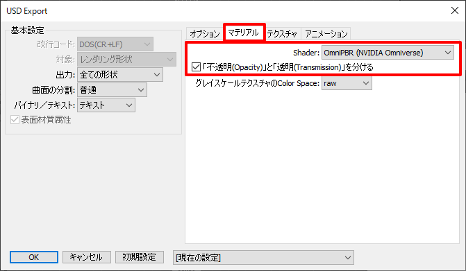

# DOKI for Shade3Dとの連携

DOKI for Shade3Dは、Intel社のOSPRay ( https://www.ospray.org/ )を使用したレンダラプラグインです。      

http://www.ft-lab.ne.jp/shade3d/DOKI/

CPUを使用したレンダラですが、GPUレンダラ並みに高速にフォトリアルな表現を行うことができます。     
このレンダラはPBRをベースとしたレンダリングを行います。     
DOKI for Shade3Dのマテリアル指定をある程度保った状態で、[NVIDIA Omniverse](../Omniverse/readme.md) 向けのUSDファイル(ShaderとしてMDLを使用)を出力することができます。      

## 起動時のバッチの記載

DOKI for Shade3Dを使用するにはOSPRayの動的ライブラリの参照、     
USD Exporter for Shade3Dを使用するにはUSDの動的ライブラリの参照、が必要となります。      
これは、Shade3Dを起動する前に指定しておく必要があります。    
この指定がない場合、これらのプラグインは認識されません。      
ここでは、Windows/Mac環境でこの2つのプラグインを同時に使用する方法を記載します。      

関連する動的ライブラリをShade3D実行に検索できるようにするため、バッチファイルを作成します。     
この際に、USDとOSPRayの両方を参照できるようにします。     

### Windows環境

以下のように、バッチファイル（*.bat）をテキストエディタで記載して、
エクスプローラでこのバッチファイルをダブルクリックしてShade3Dを起動します。    

    set USD_DLLS_PATH=E:\Data\Shade3D\USDExporter\usd_dlls    
    set OSPRAY_PATH=C:\Program Files\Intel\OSPRay v2

    set PATH=%OSPRAY_PATH%\bin;%USD_DLLS_PATH%\bin;%USD_DLLS_PATH%\lib;%PATH%

    set Shade3D_APP=C:\Program Files\Shade3D\Shade3D ver.17

    "%Shade3D_APP%\bin\shade.exe"

上記は「USD_DLLS_PATH」にUSDの検索パスを指定しています。    
「OSPRAY_PATH」にOSPRayの検索パスを指定しています。     
それぞれ環境に合わせて変更するようにしてください。      
「set PATH」で「;」で区切りながら参照パスを追加しました。      
「Shade3D_APP」にShade3Dの実行ファイルがあるパスを指定し、次の行でShade3Dを起動します。          
ここではver.17の指定を行っているため、バージョンに合わせてこの部分は書き換えるようにしてください。      

なお、起動前に「Shade3D_APP」のbin内の「tbb.dll」は「tbb._dll」のように名前変更しておくようにしてください。     
この名前変更を行わない場合は、OSPRayの認識ができません。     

### Mac環境

以下のように、バッチファイル（*.command）をテキストエディタで記載して、ファインダーでこのバッチファイルをダブルクリックしてShade3Dを起動します。    

    #!/bin/sh
    
    # Shade3Dのアプリケーションのフルパス.
    Shade3D_APP="/Volumes/HD-PEU2/Application/Shade3D ver.17.app"
    
    # Shade3Dのドキュメントディレクトリのフルパス.
    Shade3D_PLUGINS_PATH="/Users/UserName/Documents/Shade3D/Shade3D ver.17/plugins"
    
    export DYLD_LIBRARY_PATH="${Shade3D_PLUGINS_PATH}/DOKI.shdplugin/Contents/Frameworks":"${Shade3D_PLUGINS_PATH}/USDExporter.shdplugin/Contents/Frameworks"

    "${Shade3D_APP}/Contents/MacOS/xshade"

「Shade3D_APP」にShade3Dの実行ファイルがあるパスを指定します。          
ここではver.17の指定を行っているため、バージョンに合わせてこの部分は書き換えるようにしてください。      
「Shade3D_PLUGINS_PATH」でShade3Dのプラグインが格納されているフォルダを指定します。     
環境に合わせて書き換えるようにしてください。      

「export DYLD_LIBRARY_PATH」でプラグイン内の検索パスを指定しています。      
この後Shade3Dを起動しています。     

## DOKI for Shade3Dでのレンダリング結果に近づけるようにUSDをエクスポート

DOKI for Shade3Dのレンダリングに極力近づける場合は、各マテリアル指定で表面材質の「情報」より「マテリアル情報(DOKI)」を選択し、     
「マテリアルの種類」を「PBRマテリアル」とします。      
これは、表面材質のパラメータを極力そのまま加工せずにPBRマテリアルとして使用するための指定になります。      
    

詳しくは以下もご参照くださいませ。      

http://www.ft-lab.ne.jp/shade3d/DOKI/5_material/     

### 透明体を表現する場合

ガラスのような透明体を表現する場合、表面材質ウィンドウの「透明」で0.0より大きい値を指定します。     
なお、USDに渡す際は常に透明が1.0として扱われます。      
また、このときの透明色がガラスの色として使用されます。     
    

また、表面材質の「情報」より「マテリアル情報(DOKI)」を選択し、「薄い形状(thin)」をOnにすると、透明体は薄膜として扱われます。      

マテリアル情報ダイアログボックスで「マテリアルの種類」を「ガラス(Glass)」とした場合、これも透明体を表現できます。     
このときは、「薄い形状(thin)」「屈折率」「減衰の色」がUSDに渡されます。     
    
これ以外のパラメータはUSDには渡されません。      

### 発光体を表現する場合

また、表面材質の「情報」より「マテリアル情報(DOKI)」を選択し「マテリアルの種類」を「発光(Luminous)」とした場合、     
発光体を表現できます。      
    
このとき、「色」と「明るさ」がUSDに渡されます。     
Omniverseには「明るさ」の値を5000倍した値がMDL(OmniPBR)の「Emissive Intensity」に渡されます。       
これ以外のパラメータはUSDには渡されません。      

DOKIのレンダリングには反映されませんが、表面材質の「発光」を指定することでも、USDに発光が反映されます。       
    
このとき、発光値を5000倍した値がMDL(OmniPBR)の「Emissive Intensity」に渡されます。       

## USDエクスポートの指定

DOKI for Shade3Dのレンダリング結果に近くなるようにUSDをエクスポートする場合、     
エクスポートオプションの「マテリアル」で
「Shader」を「NVIDIA Omniverse(MDL)」とし、    
「不透明(Opacity)と透明度(Transmission)を分ける」チェックボックスをOnにするようにしてください。      
また「テクスチャを加工せずにベイク」チェックボックスをOnにするようにしてください（DOKIの「PBRマテリアル」を割り当てている場合）。      

    
発光と屈折のある透明（ガラス表現）が含まれる場合、USDの標準のUsdPreviewSurfaceではきれいに表現できません。     

極力OSPRayの結果に近づけたい場合は、OmniverseのMDLのようなShaderの拡張が必要となります。       
ただし、MDLを使用した場合、これは拡張指定となるため、    
AppleのAR Quick LookやPixarのusdviewなど、他の環境では正しく表現できなくなることになります。     

発光が存在しない場合、もしくは周囲を照らさない発光（単純にシェーディングに加算合成される表現）を使用する場合、     
屈折のない半透明(Opacityで「不透明」を調整)の場合は、「UsdPreviewSurface」の使用で問題ありません。      

## USDに渡されないパラメータ

DOKIで有効な以下のパラメータはUSDに渡されません。      

* PBRマテリアルとしての「クリアコート」
* PBRマテリアルとしての「光沢」
* 透明体のガラスを使用時の「減衰距離」や「厚み」

